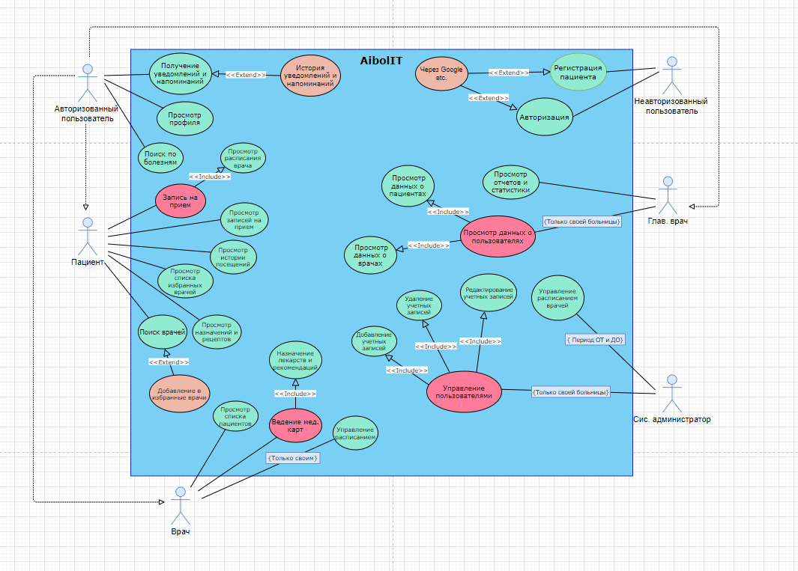

# Структура документа на первом этапе разработки

## Тема:
Комплексная медицинская система управления пациентами и медицинским персоналом

## UseCase диаграмма:

## 5. Используемые технологии:
- Языки
  - C#
  - TypeScript
- Фреймворки/библиотеки
  - ASP.NET
  - Entity Framework 
  - React 
- Вспомогательные системы
  - PostgreSQL
  - MongoDB (?)
  - Azure (?)
- Сторонние сервисы
  - PWA (?)
- Инструменты разработки
  - GIT
  - Docker 
